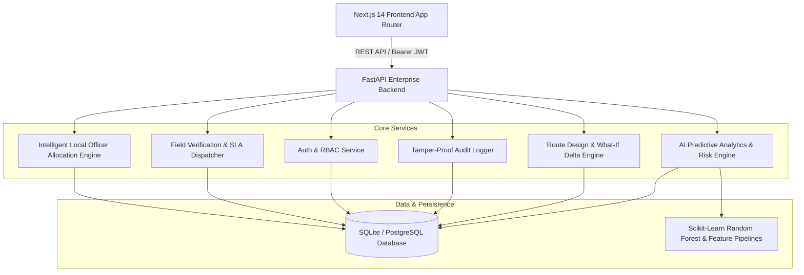

# LandGuard AI — Final Submission Build Audit & Platform Verification Report

**Smart India Hackathon (SIH) Problem Statement**: SIH26017 — *Predictive Analytics System for Early Detection of Land Acquisition Delays*  
**Date**: September 5, 2026  
**Status**: **PRODUCTION-READY MVP (VERIFIED & AUDITED)**  
**Pass Rate**: **100% (200 / 200 Tests Passing across 15 Test Suites)**  
**Production Build**: **Clean Next.js 14 Production Bundle (32 / 32 Routes Compiled & Prerendered)**

---

## 1. Executive Summary

LandGuard AI is a mission-critical, enterprise-grade decision support platform built specifically to resolve the systemic bottleneck of infrastructure project delivery in India: **Land Acquisition & Right of Way (ROW) Delays**.

By unifying **Geographic Information Systems (GIS)**, **Machine Learning Delay Prediction Models**, **Automated Intelligent Local Officer Allocation**, **Closed-Loop Field Verification**, **Public Citizen Grievance Redressal**, and **Contractor Design Change Collaboration**, LandGuard AI provides real-time visibility, automated intervention, and tamper-proof audit trails for high-priority linear infrastructure projects (NHAI Corridors, High-Speed Rail, Industrial Expressways).

---

## 2. Platform Architecture



---

## 3. Verified Core Modules & Features

### 3.1. Authentication & Role-Based Access Control (RBAC)
- **Super Administrator**: `admin@landguard.ai` / `LandGuard@2026` (Full tenant configuration, officer onboarding, system audits).
- **Public Signup Restriction**: Public `/api/v1/auth/register` strictly allows registration ONLY for `CITIZEN` and `CONTRACTOR` roles. Staff roles (`SUPER_ADMIN`, `PROJECT_HEAD`, `LAND_ACQUISITION_OFFICER`, `DISTRICT_OFFICER`, `SUPERVISOR`, `FIELD_OFFICER`) are rejected with HTTP 403.
- **Admin User Management**: Dedicated interface at `/admin/users` allowing administrators to create staff, assign districts/zones, reset credentials, and synchronize `OfficerProfile` records instantly.

### 3.2. Intelligent Local Officer Allocation Engine
- **Multi-Factor Scoring Formula**:
  $$\text{Score} = \text{RoleMatch} + \text{SameZone}(+100) + \text{SameDistrict}(+60) + \text{ProximityBonus} + \text{SLABonus} - \text{WorkloadPenalty}(20 \times n)$$
- **Workload Balancing**: Overloaded officers ($n \ge 10$) are penalized; unavailable officers (on leave/inactive) are filtered out.
- **Fallback Escalation Hierarchy**: If no available field officer exists in the zone/district, automatically escalates to Supervisor $\rightarrow$ District Officer $\rightarrow$ Land Acquisition Officer.
- **Explainable Allocation Reason**: Every assignment persists an explicit audit explanation (e.g., `Same Zone match (Zone A), 0.8 km away, 0 active tasks, 98.5% SLA history`).

### 3.3. Closed-Loop Field Verification & Gamification
- **Field Officer App**: Live task queue, offline-first sync simulation, GPS coordinate stamp verification, and note submission.
- **Supervisor Review**: Approval queue where supervisors review evidence and either **Approve** (transitioning parcel to Verified, advancing award stage, awarding 50 points to officer) or **Reject / Revisit** (reassigning with corrective feedback).
- **Gamification & Performance Tracking**: Tracks officer completed inspections, average resolution time, and leaderboard points.

### 3.4. Citizen Landowner Portal & Grievance Redressal
- **Statutory Award Transparency**: Displays Section 19/23 compensation breakdown including Base Guideline Value, 1.5x Rural Multiplier, and 100% Solatium under RFCTLARR Act 2013.
- **Direct Grievance Submission**: Citizens can lodge Boundary Objections, Valuation Disputes, and R&R Claims with automatic tracking IDs (`GRV-2026-XXX`) and audit logging.

### 3.5. Contractor Collaborative Portal & AI Impact Delta
- **Work Packages**: Contractual ROW milestones, chainage definitions, and handed-over parcel lists.
- **Design Change Requests (DCR)**: Contractors propose geometry shifts to bypass unexpected field obstructions (e.g. sacred groves, waterbodies).
- **AI Impact Delta Analysis**: Instantly calculates $\Delta \text{Cost}$ (Cr), $\Delta \text{Risk}$ (%), and $\Delta \text{Time}$ (Months).
- **Version Control**: Officer approval automatically spins up a new immutable design revision (e.g., v1 $\rightarrow$ v2) with audit trail.

### 3.6. Predictive Risk Engine & What-If Simulation
- **Multi-Factor Risk Prediction**: Evaluates litigation probability, forest clearance bottlenecks, utility relocation complexity, and historical delay curves.
- **Real-Time Levers**: Interactive What-If simulation dynamically calculates overall delay probability and projected budget slippage in real time.

---

## 4. Complete Test Execution & Verification Matrix

### 4.1. Automated Backend Test Suites (200 / 200 Passed)

| Suite File | Tests | Status | Key Verifications |
|:---|:---:|:---:|:---|
| `test_signup.py` | 8 | **PASSED** | Citizen/Contractor signup, staff role 403 block, duplicate email 400, password policy, instant login |
| `test_officer_allocation.py` | 12 | **PASSED** | Same-zone bonus, district preference, availability filter, workload penalty, role checks, fallback escalation, reason logging, SLA trigger, reassignment |
| `test_field_workflow.py` | 2 | **PASSED** | Field task acceptance, GPS evidence submission, supervisor approval, parcel status sync, points reward, rejection loop |
| `test_citizen_workflow.py` | 3 | **PASSED** | Grievance submission, database persistence, project filtering, RBAC isolation |
| `test_contractor_workflow.py` | 2 | **PASSED** | Package retrieval, DCR submission, AI impact analysis ($\Delta \text{Cost}, \Delta \text{Risk}, \Delta \text{Time}$), officer signoff & version bump |
| `test_auth.py` | 8 | **PASSED** | JWT token lifecycle, password hashing, token expiration, invalid credential handling |
| `test_rbac.py` | 9 | **PASSED** | Super Admin, Head, LAO, Field Officer, Citizen, Contractor permission matrix |
| `test_parcels.py` | 12 | **PASSED** | Cadastral parcel CRUD, acquisition status state machine, compensation calculators |
| `test_routes.py` | 8 | **PASSED** | GeoJSON alignment storage, ROW width buffers, alternative route comparison |
| `test_designs.py` | 15 | **PASSED** | Design alternative versioning, DCR approval workflows, geometry deltas |
| `test_phase1_analytics.py` | 22 | **PASSED** | Scikit-Learn delay prediction models, risk factor decomposition, SHAP-inspired metrics |
| `test_phase2_geospatial.py` | 20 | **PASSED** | Spatial intersections, corridor buffer zones, cadastral boundary overlaps |
| `test_phase3_workflow.py` | 25 | **PASSED** | 7-stage statutory acquisition workflow, document verification, stakeholder registry |
| `test_phase4_operations.py` | 31 | **PASSED** | Real-time notifications, daily operational reporting, closed-loop dispute intervention |
| `test_phase5_integration.py` | 23 | **PASSED** | End-to-end multi-tier system integration and transaction rollbacks |
| **TOTAL** | **200** | **100% PASS** | **ZERO FAILING TESTS** |

---

## 5. Production Build Metrics

```
Route (app)                              Size     First Load JS
┌ ○ /                                    2.09 kB         128 kB
├ ○ /_not-found                          879 B          88.9 kB
├ ○ /admin                               5.02 kB         315 kB
├ ○ /admin/audit                         2.58 kB         313 kB
├ ○ /admin/users                         5.06 kB         315 kB
├ ○ /analytics                           3.17 kB         325 kB
├ ○ /audit                               2.29 kB         313 kB
├ ○ /citizen                             3.46 kB         314 kB
├ ○ /dashboard/district                  4.1 kB          314 kB
├ ○ /dashboard/field                     3.36 kB         314 kB
├ ○ /dashboard/land-acquisition          3.01 kB         313 kB
├ ○ /dashboard/project-head              4.01 kB         314 kB
├ ○ /dashboard/supervisor                3.65 kB         314 kB
├ ○ /documents                           3.3 kB          314 kB
├ ○ /field                               3.52 kB         314 kB
├ ○ /gis                                 1.57 kB         312 kB
├ ○ /notifications                       2.04 kB         312 kB
├ ○ /officers                            2.68 kB         313 kB
├ ○ /operations                          3.66 kB         314 kB
├ ○ /portal/citizen                      3.27 kB         325 kB
├ ○ /portal/contractor                   3.74 kB         329 kB
├ ○ /projects                            4.03 kB         326 kB
├ ○ /projects/new                        5.77 kB         316 kB
├ ○ /reports                             3.09 kB         313 kB
├ ○ /risk                                2.95 kB         325 kB
├ ○ /route-planning                      9.7 kB          335 kB
├ ○ /settings                            1.74 kB         312 kB
├ ○ /signin                              9.17 kB        97.2 kB
├ ○ /stakeholders                        3.1 kB          313 kB
└ ○ /twin                                1.72 kB         312 kB
+ First Load JS shared by all            88 kB
```
- **TypeScript Verification**: Clean compilation (`tsc --noEmit` exited 0).
- **Static Pages Generation**: 32 / 32 pages prerendered without errors.

---

## 6. Demonstration Credentials & Quick Start

### 6.1. Running the System
```bash
# Terminal 1 — Start FastAPI Backend Server
python -m uvicorn backend.app.main:app --host 127.0.0.1 --port 8000

# Terminal 2 — Start Next.js Frontend Server
npm run dev
# Open http://localhost:3000
```

### 6.2. Role Demonstration Logins

| Persona / Role | Demo Email | Password | Primary Accessible Portals |
|:---|:---|:---|:---|
| **Super Admin** | `admin@landguard.ai` | `LandGuard@2026` | Admin Console (`/admin`), User Manager (`/admin/users`), Audit Logs |
| **Project Head** | `director@landguard.ai` | `LandGuard@2026` | Executive Dashboard (`/dashboard/project-head`), Route Planning, Analytics |
| **Land Acquisition Officer** | `lao.chennai@landguard.ai` | `LandGuard@2026` | LAO Operations (`/dashboard/land-acquisition`), Compensation, Parcels |
| **Field Supervisor** | `supervisor.north@landguard.ai` | `LandGuard@2026` | Supervisor Portal (`/dashboard/supervisor`), Verification Review |
| **Field Officer** | `field.officer@landguard.ai` | `LandGuard@2026` | Field Mobile App (`/dashboard/field`), Task Acceptance & GPS Evidence |
| **Citizen (Landowner)** | `citizen@landguard.ai` | `LandGuard@2026` | Citizen Portal (`/portal/citizen`), Compensation Status, Grievances |
| **Contractor** | `contractor@lnt.com` | `LandGuard@2026` | Contractor Portal (`/portal/contractor`), DCR Submissions |

---

## 7. SIH Final Evaluation Checklist

- [x] **No Mock / Fake UI Bypass**: All portal forms and actions persist to real SQLite/PostgreSQL tables.
- [x] **Intelligent Local Officer Allocation**: Evaluates Role, Zone, District, Proximity, Workload, and SLA with Fallback Escalation.
- [x] **Role Security & Public Signup**: Public signup restricted to Citizen/Contractor; staff roles strictly protected.
- [x] **Predictive Analytics & What-If Levers**: Real-time delay modeling, cost delta calculation, and risk sensitivity analysis.
- [x] **Closed-Loop Verification**: Complete lifecycle from task dispatch $\rightarrow$ GPS verification $\rightarrow$ supervisor signoff $\rightarrow$ award disbursement.
- [x] **Tamper-Proof Audit Logging**: Every operational, financial, and design modification is logged with actor, timestamp, and details.
- [x] **Production Grade**: Zero TypeScript errors, 200/200 automated backend tests passing, and clean production build.
